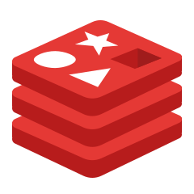
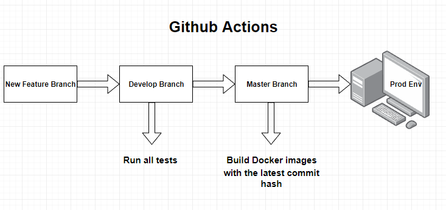
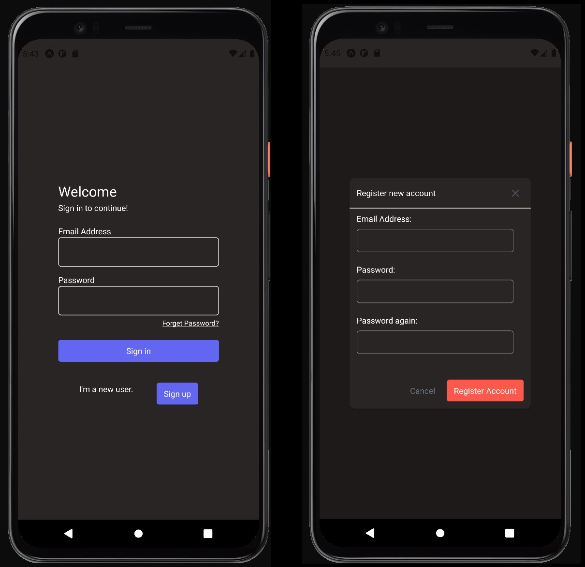
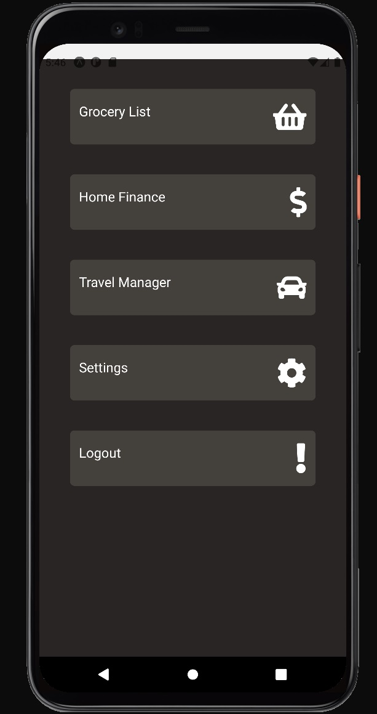
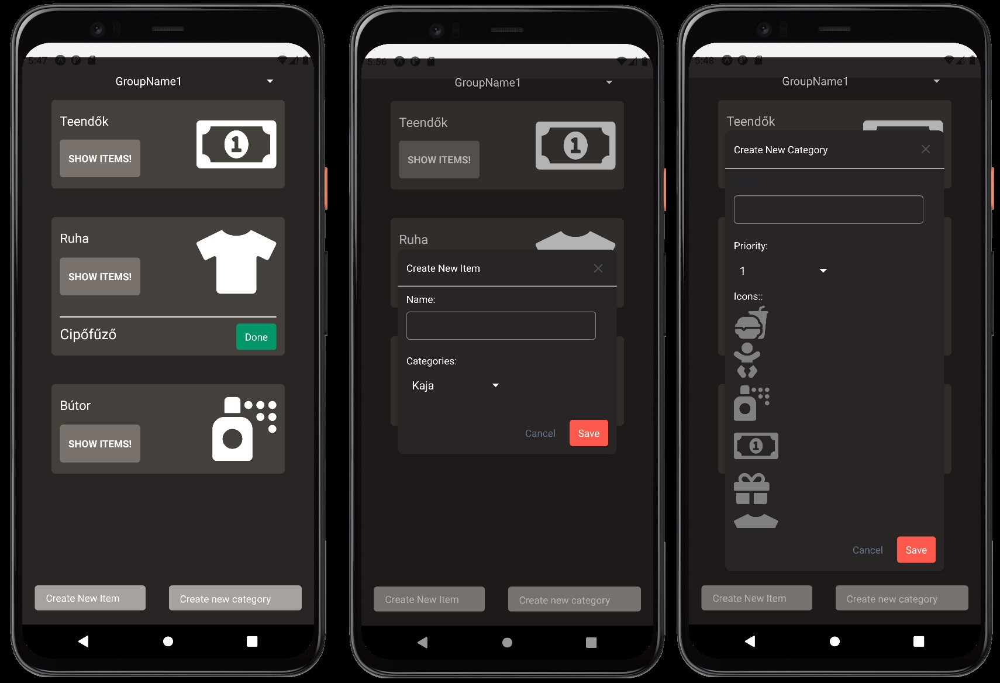
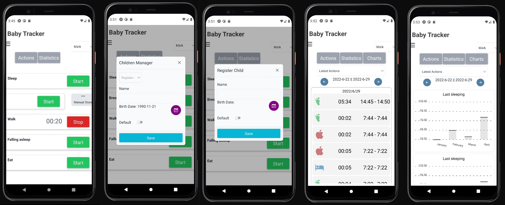

# LifeHelper Mobile Application with Backend MicroServices

## Roadmap

- [x] Create The authentication layer
- [x] Create the Grocery Service
- [x] Create automatized docker images creation
- [x] Create Github actions automatized test flow
- [x] Create Weight tracker Frontend - Alpha version has been released
- [x] Create BabySleep tracker Frontend - Production version has been released! 2022-07-10
- [x] Create BabySleep tracker Backend - Production version has been released! 2022-07-10
- [ ] Swagger API documentation
- [ ] Create Weight tracker Backend
- [ ] Create BudgetTracker Frontend
- [ ] Create BudgetTracker Backend

### Used Technologies:

# Backend

## Architecture

The backend code has been written in NodeJS + TypeScript, C# and Kotlin.

The used NodeJS framework is Hapi.

# Services

## There are six different microservices.

---

### ApiGateway

- The only exposed service
- Fordwards the requests between the services and the client side

---

### Auth web process

- Validate the Login credentials
- Validate the session Cookie and returns the account informations
- Database:
  - MySql
  - Redis
  - Store sessions

---

### Auth worker process

- Handles the email sendings by the forget password requests
- Handles the email sendings by the registration requests

---

### Grocery Service

#### Grocery list with shared groups.

#### It is a basic "To-do-list like" application with backend services.

- Serve the grocery list by the groupId
- Create new categories
- Delete categories
- Create new items
- Delete items
- Create User groups
- Delete user groups
- Database:
  - MySql

---

### BabyTracker Service

#### Main puropose is to Store baby actions's duration like (eat,sleep,walking etc.) and visualize the stored date into specified statistics and charts

- Store baby actions's duration like (eat,sleep,walking etc.)
- Manage the latest actions (modify,delete)
- Register and manage children (Save, modify, remove)
  - **Side Note: For etical reason the "remove child" is hidden by default. In the children manager menu the user should tap the header 7 times before it appears**
- Parenthsip Manager:
  - You can invite other user to be a parent of your registerec children via email address
  - You can manage your sent end received pending invitations as well. (Accept, decline or delete)
  - One account can only have one partner.
    - **Poligamy not allowed!**
  - You can divorce from a partner too in the aplication.
    - After the divorce the partners got acces only the registered children by the users
    - **Side note: For etical reason this menu is hidden by default. It will appears after the user tapped the parentship manager menu"s header 7 times**

---

### Weight tracker

#### In development

#### A weight tracker application with backend service. Store and visualize the progress of your wegith gaining/losing journey.

- Save and modify your daily weight.
- Update or delete your already saved records.
- Visualize your progress via statistics and charts.

---

### Budget Tracker

#### In development

#### Track all of your expensies and get visualized statistics and charts.

- Create, update and delete categories
- Create, update and delete records
- Create, update, delete budget warnings with multiple warning limits.
- Get statistics about your expensies via lists and charts

## Docker 

- The production environment uses docker images
- Theese images are size reduced, because of the images has been built by the transpiled javascript code.
- The images are created automaticly when the code merge has been done to the Master branch.

- The docker images are tagged with the latest commit hash.

## Github 

- If a new Pull Request has been opened to the develop branch, it triggers the test runner.

- If the master branch gets a new code merge, then the new docker images has been building and tagging them by the latest commit hash.

# Frontend: 

## Features:

- Login:

  - The user can Login into the app. ("Such a feature")
  - Can create a new account.
  - Can send a forgot password request

Menu:

The following features are done.

- Grocery List:
  - The user can create user groups and share the items between the groups
  - Can create and delete items
  - Can create and delete categories
  - Can modify categories

## 

---

- Baby Sleep Tracker:
  - Main purpose of this application is record the activities of the babies and get propper statistics based on the records
  - The user can register, remove or modify a child/children
  - Start recording the choosen activity automatically.
  - Stop recording the choosen activity automatically.
  - Record the activity manually.
  - Get different statistics based on the activity or the time intervall.
  - Get charts statistics based on the activity or the time intervall.

## 

---
