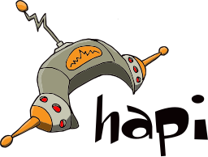
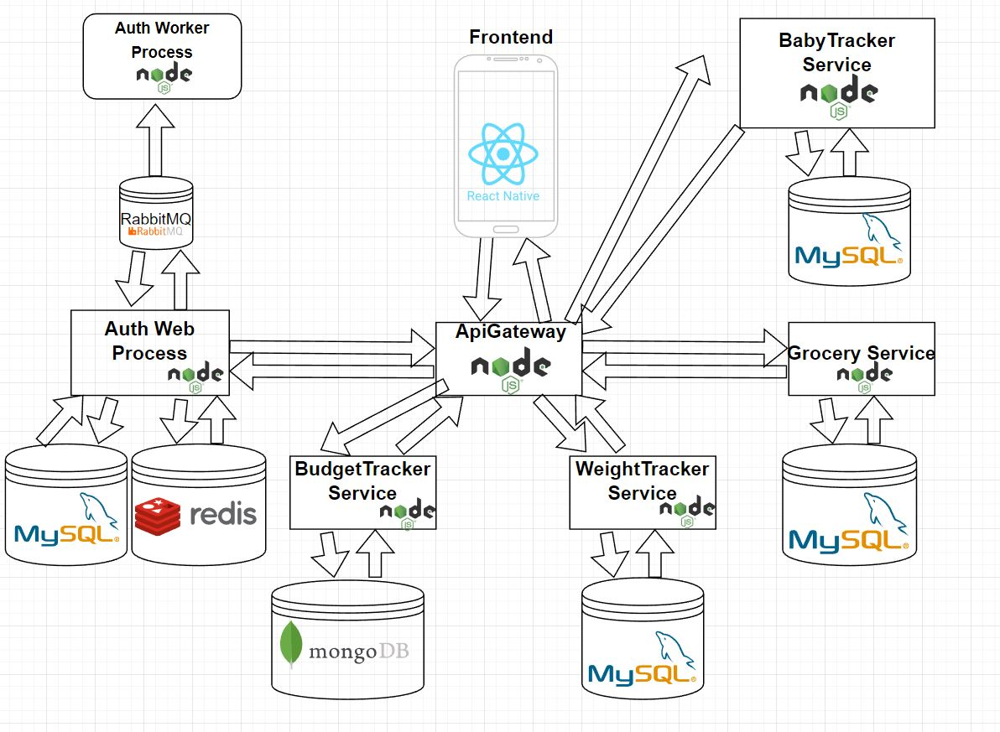

# LifeHelper Mobile Application with Backend MicroServices

## Roadmap

- [x] Create The authentication layer
- [x] Create the Grocery Service
- [x] Create automatized docker images creation
- [x] Create Github actions automatized test flow
- [x] Create Weight tracker Frontend - Alpha version has been released
- [x] Create BabySleep tracker Frontend - Alpha version has been released
- [x] Create BabySleep tracker Backend - Alpha version has been released
- [ ] Create Weight tracker Backend
- [ ] Create HomeFinance Frontend
- [ ] Create HomeFinance Backend

### Used Technologies:

# Backend

## Architecture

The backend code has been written in NodeJS + TypeScript.

The used NodeJS framework is Hapi.

## There are three different microservices.

### ApiGateway

- The only exposed service
- Fordwards the requests between the services and the client side

### Auth web process

- Validate the Login credentials
- Validate the session Cookie and returns the account informations
- Database:
  - MySql
  - Redis
  - Store sessions

### Auth worker process

- Handles the email sendings by the forget password requests
- Handles the email sendings by the registration requests

### Grocery Service

- Serve the grocery list by the groupId
- Create new categories
- Delete categories
- Create new items
- Delete items
- Create User groups
- Delete user groups
- Database:
  - MySql

## Docker 

- The production environment uses docker images
- Theese images are size reduced, because of the images has been built by the transpiled javascript code.
- The images are created automaticly when the code merge has been done to the Master branch.

- The docker images are tagged with the latest commit hash.

## Github 

- If a new Pull Request has been opened to the develop branch, it triggers the test runner.

- If the master branch gets a new code merge, then the new docker images has been building and tagging them by the latest commit hash.

# Frontend: 

## Features:

- Login:

  - The user can Login into the app. ("Such a feature")
  - Can create a new account.
  - Can send a forgot password request

Menu:

The following features are done.

- Grocery List:
  - The user can create user groups and share the items between the groups
  - Can create and delete items
  - Can create and delete categories
  - Can modify categories

## 

---

- Baby Sleep Tracker:
  - Main purpose of this application is record the activities of the babies and get propper statistics based on the records
  - The user can register, remove or modify a child/children
  - Start recording the choosen activity automatically.
  - Stop recording the choosen activity automatically.
  - Record the activity manually.
  - Get different statistics based on the activity or the time intervall.
  - Get charts statistics based on the activity or the time intervall.

## 

---
